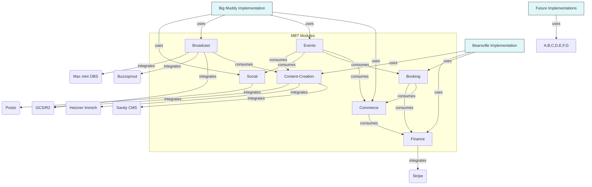

<!--
  Generated by scripts/ai/gemini-batch.mjs on 2026-04-19T08:50:43.542Z
  Task: tech-doc-architecture-overview
  Model: gemini-2.5-flash
  Tokens: 9385 (prompt 389 + completion 7164)
-->

# MBT Platform Architecture Overview

Welcome to the MBT Platform! This document is designed to give you a comprehensive overview of our system's architecture, key components, and fundamental workflows. As a new engineer, understanding these foundational concepts will be crucial for navigating our codebase, contributing effectively, and appreciating how everything fits together.

The MBT Platform is a multi-tenant, modular application designed to power a diverse range of event, booking, commerce, and content experiences. It's built with scalability, flexibility, and extensibility in mind, allowing us to serve various clients (tenants) with tailored solutions while leveraging a shared core.

## 1. The Three Layers: HDI → MBT → Implementations

Our entire ecosystem is structured into three distinct, hierarchical layers:

### 1.1. HDI (Holding)

At the very top is **HDI (Holding)**. This layer represents the overarching corporate entity or parent organization that owns and oversees the entire technology stack and its various ventures. From an architectural perspective, HDI provides the strategic direction, funding, and high-level governance for the MBT Platform. It's the business umbrella under which MBT operates.

*   **Role**: Corporate governance, strategic direction, financial oversight, legal entity.
*   **Relationship to MBT**: HDI is the parent company that owns and manages the MBT Platform as a core product or service offering.

### 1.2. MBT (Platform)

The **MBT Platform** is the core of our technical architecture. It's a robust, multi-tenant backend system designed to provide a comprehensive set of services to various clients. Think of MBT as a highly configurable engine that can be adapted to power different "implementations" for different "tenants." It handles common functionalities such as user management, authentication, authorization, data storage, and the business logic encapsulated within its modular packages.

*   **Role**: Core multi-tenant backend services, shared business logic, data persistence, API gateway.
*   **Key Characteristics**: Modular, scalable, extensible, API-driven.
*   **Relationship to Implementations**: MBT provides the foundational APIs and services that implementations consume to build their specific user experiences.

### 1.3. Implementations (Big Muddy, Bearsville, future)

**Implementations** are the specific, tenant-facing applications or products built on top of the MBT Platform. These are the front-end applications, specialized tools, or branded experiences that end-users and tenant administrators interact with directly. While they leverage the MBT Platform's powerful backend, each implementation can have its unique branding, UI/UX, and specific feature sets tailored to its target audience or business model.

*   **Examples**:
    *   **Big Muddy**: A dedicated implementation focused on large-scale event management, ticketing, and broadcast experiences. It consumes MBT's `events`, `commerce`, `broadcast`, and `social` modules extensively.
    *   **Bearsville**: An implementation geared towards hospitality, resort management, and bespoke booking experiences. It heavily utilizes MBT's `booking`, `finance`, and `content-creation` modules.
    *   **Future Implementations**: The architecture is designed to support new implementations for different verticals (e.g., educational platforms, community hubs, digital marketplaces) by leveraging the existing MBT modules and potentially extending them.
*   **Role**: User interface, specific branding, tenant-specific workflows, consumption of MBT APIs.
*   **Relationship to MBT**: Implementations are clients of the MBT Platform, consuming its APIs and services to deliver their unique value propositions.

### Layer Diagram

```mermaid
graph TD
    A[HDI (Holding Company)] --> B(MBT Platform)
    B --> C1[Implementation: Big Muddy]
    B --> C2[Implementation: Bearsville]
    B --> C3[Implementation: Future Product X]
    B --> C4[Implementation: Future Product Y]

    style A fill:#f9f,stroke:#333,stroke-width:2px
    style B fill:#bbf,stroke:#333,stroke-width:2px
    style C1 fill:#ccf,stroke:#333,stroke-width:1px
    style C2 fill:#ccf,stroke:#333,stroke-width:1px
    style C3 fill:#ccf,stroke:#333,stroke-width:1px
    style C4 fill:#ccf,stroke:#333,stroke-width:1px
```

## 2. The Five Tenants Today + Multi-Tenant Routing

The MBT Platform is fundamentally a multi-tenant system. This means a single instance of the platform serves multiple distinct organizations or "tenants," each with their own isolated data and configurations.

### 2.1. Current Tenants

As of today, the MBT Platform serves five primary tenants:

1.  **Big Muddy Events Co.**: Our flagship tenant, focused on large-scale events, live streams, and community engagement.
2.  **Bearsville Resorts & Experiences**: A tenant specializing in unique hospitality bookings, resort management, and curated guest experiences.
3.  **Summit Adventures Group**: An outdoor adventure and tour operator, utilizing MBT for booking, equipment rental, and content showcasing their expeditions.
4.  **Urban Culture Collective**: A tenant managing diverse urban cultural events, workshops, and artist showcases, leveraging MBT for event listings and ticketing.
5.  **Digital Frontier Agency**: A creative agency using MBT to manage client projects, content collaboration, and internal resource booking.

Each of these tenants benefits from the shared infrastructure and modularity of MBT, while experiencing a customized solution through their respective implementations.

### 2.2. Multi-Tenant Routing

A critical aspect of our multi-tenant architecture is how we identify and route requests to the correct tenant's context. This is primarily achieved through **hostname-based routing**.

When a request enters our system (typically via Vercel), the first step is to inspect the incoming `Host` header. Each tenant is associated with one or more unique domains or subdomains.

```
Example Hostnames:
- bigmuddy.com        -> Tenant: Big Muddy Events Co.
- app.bigmuddy.com    -> Tenant: Big Muddy Events Co. (admin interface)
- bearsville.com      -> Tenant: Bearsville Resorts & Experiences
- summitadventures.com -> Tenant: Summit Adventures Group
...etc.
```

Upon identifying the tenant from the hostname, a `TenantContext` object is established early in the request lifecycle (within our Vercel middleware). This context object contains vital information such as:

*   `tenantId`: A unique identifier for the tenant.
*   `tenantSlug`: A human-readable slug for the tenant.
*   `tenantConfig`: Tenant-specific configurations (e.g., branding, feature flags, external service API keys).
*   `databaseSchema`: For tenants using isolated schemas, this would specify the target schema. (Note: Currently, we primarily use row-level security and `tenantId` columns for data isolation within a single schema, but the architecture supports schema-per-tenant if needed.)

This `TenantContext` is then propagated throughout the request, ensuring that all subsequent data access, business logic execution, and external service calls are performed within the scope of the identified tenant. This guarantees data isolation and prevents one tenant from accessing another's data.

### Multi-Tenant Routing Diagram

```
+----------------+       +-------------------+       +--------------------+       +---------------------+
|   User Request |       | Vercel Middleware |       | Tenant Route Group |       | Application Handler |
|  (e.g., bigmuddy.com)  |   (Hostname Check)  |       |   (Tenant Context)   |       |   (Module Logic)    |
+--------+-------+       +----------+--------+       +----------+---------+       +----------+----------+
         |                          |                            |                              |
         | Host: bigmuddy.com       | Determine Tenant ID        | Route to tenant's handlers   |
         +------------------------->| (Tenant: Big Muddy)        +----------------------------->|
                                    |                            |                              |
                                    | Set TenantContext          |                              |
                                    | { tenantId: 'bmco', ... }  |                              |
                                    +----------------------------+
```

## 3. The 7 Module Packages

The MBT Platform's backend is organized into a monorepo structure, with core business functionalities encapsulated within seven distinct module packages. These modules are published as `@bigmuddy/*` packages (a historical naming convention, as Big Muddy was our first major tenant/implementation). This modularity promotes separation of concerns, reusability, and independent development.

Each module owns its specific domain logic, data models, and API surface. They communicate with each other primarily through well-defined interfaces, shared events (see Event Lifecycle), or direct service calls where appropriate.

### 3.1. `@bigmuddy/commerce`

*   **What it owns**: All aspects related to product sales, subscriptions, pricing, shopping carts, orders, and payment processing integration. This module manages the lifecycle of marketable items and financial transactions related to them.
*   **Key Responsibilities**: Product catalog management, inventory, pricing rules, promotions, shopping cart state, order fulfillment workflows, subscription management (recurring billing), payment gateway interactions (Stripe).
*   **Who consumes which**:
    *   **Consumed by**: `events` (for event ticketing sales), `booking` (for booking add-ons or package sales), `finance` (for transaction reconciliation), `implementations` (for storefronts and checkout flows).
    *   **Consumes**: `finance` (for invoicing), `events` (for event-specific products), `booking` (for resource-specific products).

### 3.2. `@bigmuddy/booking`

*   **What it owns**: Management of bookable resources, availability, reservations, and scheduling. This module handles the complexities of time-based bookings, resource allocation, and capacity management.
*   **Key Responsibilities**: Resource definitions (e.g., rooms, equipment, staff), availability calendars, reservation creation, modification, and cancellation, capacity management, booking rules (e.g., minimum stay, lead time).
*   **Who consumes which**:
    *   **Consumed by**: `commerce` (for booking-related product bundles), `events` (for reserving event spaces), `finance` (for booking-related invoices), `implementations` (for booking interfaces).
    *   **Consumes**: `commerce` (for pricing bookings), `finance` (for payment processing).

### 3.3. `@bigmuddy/finance`

*   **What it owns**: Core financial operations, invoicing, payment tracking, ledger entries, and integrations with accounting systems. This module is the single source of truth for all monetary transactions within the platform.
*   **Key Responsibilities**: Invoice generation, payment record keeping, transaction logging, tax calculation, refunds, general ledger integration (future), reporting.
*   **Who consumes which**:
    *   **Consumed by**: `commerce` (for processing payments and generating invoices for orders/subscriptions), `booking` (for processing booking payments), `events` (for event ticket revenue), `implementations` (for financial dashboards).
    *   **Consumes**: External payment gateways (Stripe).

### 3.4. `@bigmuddy/events`

*   **What it owns**: Creation, management, and promotion of events, including scheduling, venue management, ticketing, and attendee management.
*   **Key Responsibilities**: Event definition (dates, times, locations), venue management, session scheduling, ticket types and pricing, attendee registration, check-in, and communication.
*   **Who consumes which**:
    *   **Consumed by**: `commerce` (for selling tickets and event merchandise), `broadcast` (for live streaming events), `social` (for event promotion), `content-creation` (for event-related content), `implementations` (for event listings and registration).
    *   **Consumes**: `commerce` (for ticket sales), `booking` (for venue reservation), `social` (for sharing).

### 3.5. `@bigmuddy/broadcast`

*   **What it owns**: Functionality related to live streaming, video-on-demand (VOD), and audio content distribution. This module manages stream ingest, encoding, storage, and delivery.
*   **Key Responsibilities**: Live stream setup and management, VOD asset management, stream recording, content distribution (CDN integration), podcast publishing (Buzzsprout integration).
*   **Who consumes which**:
    *   **Consumed by**: `events` (for live event broadcasts), `content-creation` (for managing video/audio assets), `social` (for sharing broadcasts), `implementations` (for viewing live streams and VOD).
    *   **Consumes**: External streaming services (OBS via Mac mini), storage (GCS, R2), podcast platforms (Buzzsprout).

### 3.6. `@bigmuddy/social`

*   **What it owns**: Features enabling social interaction, community building, user profiles, comments, and notifications.
*   **Key Responsibilities**: User profiles (beyond basic auth), activity feeds, commenting systems, direct messaging (future), notification generation, content sharing.
*   **Who consumes which**:
    *   **Consumed by**: `events` (for event discussion), `broadcast` (for live chat), `content-creation` (for user-generated content features), `implementations` (for social features).
    *   **Consumes**: External social media APIs (Postiz for cross-posting).

### 3.7. `@bigmuddy/content-creation`

*   **What it owns**: Tools and workflows for creating, managing, and publishing various types of digital content (articles, media assets, documents). This module often integrates with external CMS and asset management systems.
*   **Key Responsibilities**: Content drafting and publishing workflows, media asset management (images, videos), document storage, content versioning, integration with headless CMS (Sanity), image optimization (Immich).
*   **Who consumes which**:
    *   **Consumed by**: `events` (for event descriptions and marketing materials), `broadcast` (for VOD metadata), `social` (for sharing content), `commerce` (for product descriptions), `booking` (for resource descriptions), `implementations` (for content display).
    *   **Consumes**: External CMS (Sanity), image/video storage (GCS, R2, Immich).

### Module Dependency Diagram



## 4. The 21 Prisma Models Added in Phase C

During Phase C of the MBT Platform development, we significantly expanded our data model to support the rich functionalities of our modules. This involved introducing 21 new Prisma models, carefully designed to ensure data integrity and support the business logic of each module.

Here's a quick overview linking each model to its owning module:

| Model Name                 | Owning Module          | Brief Description                                                                 |
| :------------------------- | :--------------------- | :-------------------------------------------------------------------------------- |
| `Product`                  | `@bigmuddy/commerce`   | Represents a sellable item or service.                                            |
| `ProductVariant`           | `@bigmuddy/commerce`   | Specific variant of a product (e.g., size, color, ticket tier).                   |
| `Order`                    | `@bigmuddy/commerce`   | A customer's confirmed purchase.                                                  |
| `OrderItem`                | `@bigmuddy/commerce`   | Individual line item within an order.                                             |
| `Subscription`             | `@bigmuddy/commerce`   | Recurring billing agreement for a product or service.                             |
| `Resource`                 | `@bigmuddy/booking`    | A bookable entity (e.g., room, equipment, staff member).                          |
| `AvailabilitySlot`         | `@bigmuddy/booking`    | Defines a specific time slot when a resource is available.                        |
| `Reservation`              | `@bigmuddy/booking`    | A confirmed booking for a resource at a specific time.                            |
| `BookingRule`              | `@bigmuddy/booking`    | Rules governing how a resource can be booked (e.g., minimum duration).            |
| `Invoice`                  | `@bigmuddy/finance`    | A bill for goods or services rendered.                                            |
| `Transaction`              | `@bigmuddy/finance`    | Record of a financial operation (payment, refund, charge).                        |
| `PaymentGatewayAccount`    | `@bigmuddy/finance`    | Stores credentials and configuration for a tenant's payment gateway.              |
| `Event`                    | `@bigmuddy/events`     | A scheduled occurrence with a date, time, and description.                        |
| `EventSession`             | `@bigmuddy/events`     | A specific segment or session within a larger event.                              |
| `Ticket`                   | `@bigmuddy/events`     | An entry pass or entitlement to an event or session.                              |
| `Stream`                   | `@bigmuddy/broadcast`  | Live stream configuration and metadata.                                           |
| `Episode`                  | `@bigmuddy/broadcast`  | A single episode of a podcast or VOD series.                                      |
| `Channel`                  | `@bigmuddy/broadcast`  | A collection of related streams or episodes.                                      |
| `Post`                     | `@bigmuddy/social`     | User-generated content item (e.g., status update, article link).                  |
| `Comment`                  | `@bigmuddy/social`     | A response or remark on a `Post`, `Event`, or other content.                      |
| `MediaAsset`               | `@bigmuddy/content-creation` | A digital file (image, video, document) managed by the platform.                  |

Each of these models is defined in the `schema.prisma` file within its respective module, and the entire database schema is managed through Prisma Migrations. Tenant isolation for these models is typically achieved through a `tenantId` column on each relevant table, combined with row-level security policies or application-level filtering based on the `TenantContext`.

## 5. Existing Infrastructure

The MBT Platform leverages a combination of cloud services, self-hosted solutions, and specialized hardware to deliver its functionality. Understanding these components is key to grasping our operational environment.

*   **Vercel (Frontend Hosting & Serverless Functions)**:
    *   **Role**: Primary hosting platform for our Next.js-based implementations (frontends) and our serverless API endpoints (backend routes).
    *   **How it's used**: Handles all incoming HTTP requests, routes them to the appropriate serverless functions (our API handlers), and serves static assets for our frontends. Also hosts Vercel Cron jobs. Its global CDN ensures low latency.

*   **Postgres (Primary Database)**:
    *   **Role**: Our main relational database for persistent storage of all core application data.
    *   **How it's used**: Managed service (e.g., Supabase, Neon, or a dedicated cloud provider's Postgres offering). All Prisma models defined in our modules map to tables in Postgres. Data isolation between tenants is handled via `tenantId` columns and application-level filtering or row-level security.

*   **Cloudflare (DNS & Edge Network)**:
    *   **Role**: DNS management, global CDN, WAF (Web Application Firewall), DDoS protection, and edge caching.
    *   **How it's used**: All tenant domains are pointed to Cloudflare, which then proxies requests to Vercel. This provides an additional layer of security, performance optimization, and reliability.

*   **Hetzner Immich (Self-hosted Photo Management)**:
    *   **Role**: Dedicated self-hosted solution for high-performance photo and video asset management, particularly for internal operations and specific content-heavy tenants.
    *   **How it's used**: Integrated with `@bigmuddy/content-creation` for specialized image storage, processing (e.g., resizing, optimization), and serving. Provides more control over data locality and cost compared to pure cloud solutions for certain asset types.

*   **Mac mini (OBS for Live Broadcasts)**:
    *   **Role**: On-premise hardware used for generating high-quality live video streams, primarily for the `@bigmuddy/broadcast` module.
    *   **How it's used**: Runs OBS (Open Broadcaster Software) to capture and encode live video feeds. These streams are then pushed to cloud services (like GCS or R2) for distribution, acting as an ingest point for our broadcast pipeline. It provides a reliable and controllable local capture environment.

*   **Sanity (Headless CMS)**:
    *   **Role**: External, headless Content Management System.
    *   **How it's used**: Integrated with `@bigmuddy/content-creation` for managing structured content (articles, blog posts, static page content). Authors and content managers use Sanity's studio to create and edit content, which is then fetched by our platform via Sanity's API.

*   **Stripe (Payment Processing)**:
    *   **Role**: External payment gateway for handling credit card transactions, subscriptions, and payouts.
    *   **How it's used**: Integrated with `@bigmuddy/commerce` and `@bigmuddy/finance` for securely processing payments, managing customer billing information, and handling recurring subscriptions.

*   **Google Cloud Storage (GCS) / Cloudflare R2 (Object Storage)**:
    *   **Role**: Distributed object storage for large files, media assets, and backups.
    *   **How it's used**:
        *   **GCS**: Primary storage for general media assets, larger video files, and backups, integrated with `@bigmuddy/content-creation` and `@bigmuddy/broadcast`.
        *   **R2**: Used for cost-effective storage of less frequently accessed or static media, and as a potential CDN origin, especially for broadcast assets. Offers S3-compatible API.

### Infrastructure Diagram

```
+--------------------+   +---------------------+   +---------------------+
|      User/Client   |   |   Cloudflare (DNS,WAF,CDN) |   |   Vercel (Frontend, Serverless) |
+----------+---------+   +----------+----------+   +----------+----------+
           |                        |                          |
           |                        |                          |
           | HTTP Request           | DNS/Proxy                | HTTP Request
           +----------------------->+------------------------->+
                                    |                          |
                                    |                          |
                                    |                          | API Calls
                                    |                          |
+-----------------------------------+--------------------------+-----------------------------------+
|                                   | MBT PLATFORM BACKEND     |                                   |
|                                   V                          V                                   |
|                          +-----------------+           +-----------------+                       |
|                          |     Postgres    |           |    @bigmuddy/*  |                       |
|                          |  (Primary DB)   |           |    (Modules)    |                       |
|                          +--------+--------+           +--------+--------+                       |
|                                   ^                            |                                   |
|                                   | SQL/ORM                    | API/Event Bus                     |
|                                   |                            |                                   |
|   +-------------------+           |                            V                                   |
|   | Hetzner Immich    |<----------+----------------------------+-----------------------+           |
|   | (Photo Storage)   |                                        |                       |           |
|   +-------------------+                                        |                       |           |
|                                                                |                       |           |
|   +-------------------+                                        |                       |           |
|   | Mac mini (OBS)    |--------------------------------------->|                       |           |
|   | (Live Ingest)     |                                        |                       |           |
|   +-------------------+                                        |                       |           |
|                                                                |                       |           |
|   +-------------------+                                        |                       |           |
|   | Sanity (Headless CMS) |<-----------------------------------+                       |           |
|   +-------------------+                                        |                       |           |
|                                                                |                       |           |
|   +-------------------+                                        |                       |           |
|   | Stripe (Payments) |<---------------------------------------+                       |           |
|   +-------------------+                                        |                       |           |
|                                                                |                       |           |
|   +-------------------+                                        |                       |           |
|   | GCS / R2          |<---------------------------------------+-----------------------+           |
|   | (Object Storage)  |                                                                           |
|   +-------------------+                                                                           |
|                                                                                                   |
+---------------------------------------------------------------------------------------------------+
```

## 6. Request Lifecycle

Understanding how a typical HTTP request is processed from end-to-end is fundamental.

1.  **Request Hits Vercel**: A user initiates an action (e.g., clicks a button, navigates to a page) that results in an HTTP request being sent from their browser or a client application. This request is directed to one of our tenant's domains, which is managed by Cloudflare and ultimately points to our Vercel deployment.

2.  **Vercel Edge & Middleware**: The request first hits Vercel's global edge network. Here, our Vercel serverless functions act as API endpoints. The very first code executed is our **middleware**.
    *   The middleware inspects the `Host` header of the incoming request.
    *   It identifies the `tenantId` based on the hostname mapping (e.g., `bigmuddy.com` -> `tenant_bigmuddy_co`).
    *   A `TenantContext` object is created and attached to the request, containing the `tenantId` and other tenant-specific configurations. This context is crucial for all subsequent operations.

3.  **Routes to Tenant Route Group**: Based on the `TenantContext`, the request is routed to the appropriate application handler. Our routing system might logically group routes by tenant, or simply pass the `TenantContext` to a generic handler that then uses the context to determine tenant-specific logic paths.

4.  **Handler Imports from Module**: The identified handler function (e.g., `/api/events/create`) is executed. This handler is typically a thin wrapper that imports and orchestrates business logic from one or more of our `@bigmuddy/*` module packages.
    *   Example: An `events` API handler would import functions from `@bigmuddy/events`.

5.  **Module Reads/Writes Postgres + External Services**: Inside the module's business logic:
    *   The `TenantContext` is implicitly or explicitly passed to data access layers.
    *   Prisma queries are executed against our Postgres database. These queries often include `WHERE tenantId = '...'` clauses to ensure strict data isolation.
    *   External services might be called based on the business logic (e.g., Stripe for payment processing, Sanity for content, GCS for file uploads). These calls are often abstracted behind service interfaces within the modules.

6.  **Response**: Once the business logic completes (e.g., data is saved, an external service confirms an action), the handler constructs an appropriate HTTP response (e.g., JSON data, status code) and sends it back through Vercel to the client.

### Request Lifecycle Diagram

```
+----------------+        +--------------------+        +--------------------+        +--------------------+        +--------------------+
|  User/Client   |        |  Vercel Edge/CDN   |        |  Vercel Middleware |        |   API Handler      |        | @bigmuddy/* Module |
| (Browser/App)  |        | (Global Network)   |        | (Tenant ID Lookup) |        | (Orchestration)    |        | (Business Logic)   |
+--------+-------+        +---------+----------+        +---------+----------+        +---------+----------+        +---------+----------+
         |                          |                             |                             |                             |
         | 1. HTTP Request          |                             |                             |                             |
         +------------------------->| 2. Route to Vercel          |                             |                             |
                                    +---------------------------->| 3. Parse Hostname           |                             |
                                                                  |    Identify Tenant ID       |                             |
                                                                  |    Set TenantContext        |                             |
                                                                  +----------------------------->| 4. Route to Handler         |
                                                                                                 |    Import Module Logic      |
                                                                                                 +----------------------------->| 5. Execute Logic (with TenantContext)
                                                                                                                               |    - Read/Write Postgres (tenant-scoped)
                                                                                                                               |    - Call External Services (Stripe, Sanity, etc.)
                                                                                                                               |
                                                                                                                               |<-----------------------------+
                                                                                                 | 6. Construct Response       |
                                                                                                 |<----------------------------+
                                                                  | 7. Send Response            |
                                                                  |<----------------------------+
                                    | 8. Deliver Response         |
                                    |<----------------------------+
         |<-------------------------+
         | 9. Receive Response
         |
```

## 7. Event Lifecycle

The MBT Platform heavily utilizes an event-driven architecture for inter-module communication and asynchronous processing. This pattern helps decouple modules, improve scalability, and enable robust side effects.

1.  **State Change Publishes a `BusEvent`**: When a significant state change occurs within any module's business logic, it **publishes a `BusEvent`**.
    *   Example: A new `Order` is created in `@bigmuddy/commerce`, a `Reservation` is confirmed in `@bigmuddy/booking`, or an `Event` goes live in `@bigmuddy/events`.
    *   These events are typically defined with a clear `type` (e.g., `order.created`, `reservation.confirmed`, `event.published`) and carry a payload of relevant data (e.g., `orderId`, `tenantId`, `totalAmount`).
    *   Events are published to an internal event bus (e.g., a message queue like RabbitMQ, Kafka, or a simpler in-process pub/sub for synchronous events, and a serverless queue like AWS SQS or GCP Pub/Sub for asynchronous processing). For Vercel, this often involves queuing events to be processed by dedicated worker routes.

2.  **Handlers Fire**: Other modules or dedicated event handlers are **subscribed** to specific `BusEvent` types. When an event matching their subscription is published, their corresponding handler function is triggered.
    *   A single event can trigger