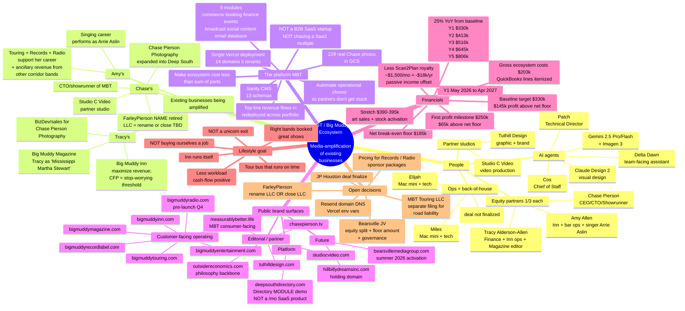
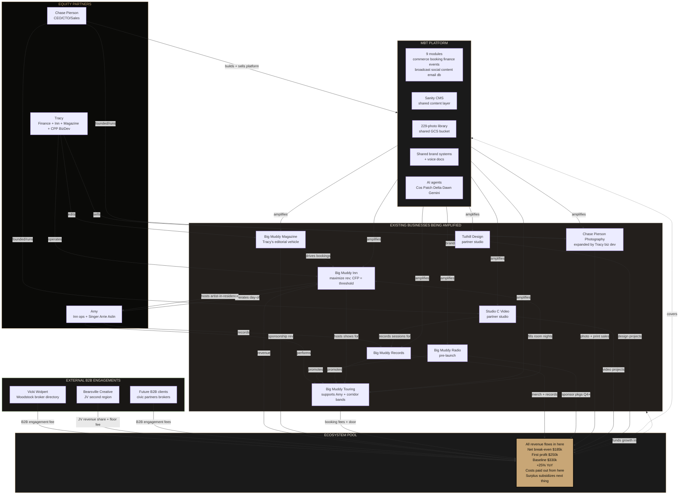
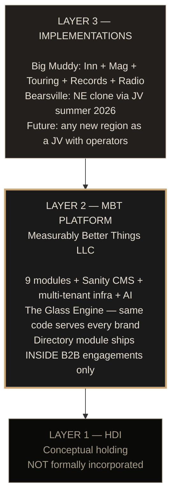
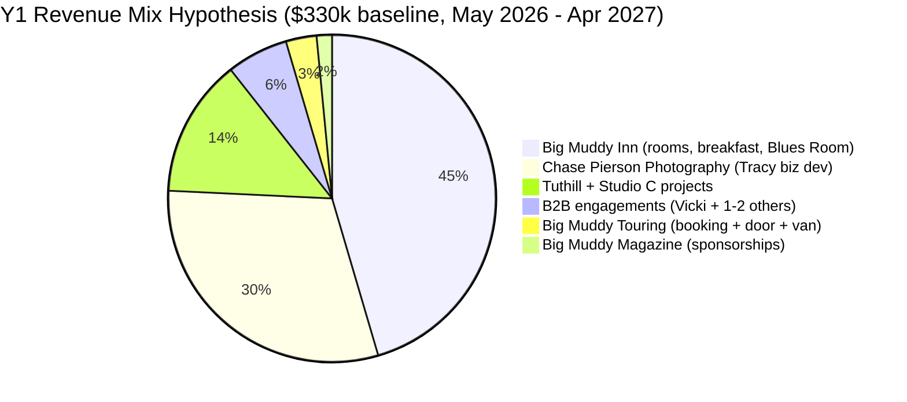

# THE THESIS — Visual Confirmation Map

**Purpose:** One-look check on the canonical state of the ecosystem as captured in `docs/THE_THESIS.md`. If anything in these diagrams doesn't match Chase's mental model, fix it BEFORE proceeding with downstream docs (pro forma re-cut, brief re-cut, memory file sweep).

**View this file on GitHub or in any Mermaid-rendering markdown viewer** to see the diagrams. The raw `mermaid` code blocks below render as actual diagrams.

---

## Diagram 1 — The Mind Map (tree view)

The seven big things that make up the ecosystem.

---

## Diagram 2 — The Relationship Flow (how things move)

Where revenue, content, and audience flow between the businesses + platform.

---

## Diagram 3 — The Three Layers (architecture restatement)

Same as the brief had, but now framed under the corrected thesis.

---

## Diagram 4 — Y1 Revenue: Where $330k Baseline Could Come From

NOT a target per line. Just a "where we'd look first" decomposition of the $330k baseline.

The slices add to $330k. They're a hypothesis of where revenue COULD come from — not commitments per line. If the Inn does $180k and Touring is $0, we can still hit baseline if other lines move. The point is the ecosystem total, not the per-brand splits.

The honest break-even floor is $191k. The $330k baseline is what we work for. Spread between them ($139k) is real profit.

(Compare to the older brief's pro forma which targeted $510k / $760k — that was aspirational and is now retired. The $191k floor and $330k baseline are the real numbers per Chase 2026-04-20.)

---

## Confirmation pinch test

Before we proceed with downstream cleanup (re-cutting the pro forma, re-aligning the brief, sweeping memory files), confirm each of these matches your model:

| # | Statement | Y/N |
|---|---|---|
| 1 | The point of all this is media-amplification of existing businesses, not a vertically-integrated startup ecosystem. | |
| 2 | Tracy operates the Inn + edits the Magazine + does BizDev/sales/management for Chase Pierson Photography. | |
| 3 | Amy is a singer with a band (performs as Arrie Aslin), and Touring + Records + Radio exist primarily to support her career, with ancillary lift for other corridor bands. | |
| 4 | The FarleyPierson name is being retired regardless. The LLC will either be renamed (TBD) or closed. | |
| 5 | The Inn's metric is "maximize revenue" — break-even is the floor, profit is the goal, quality of life is the ceiling. NOT "settle for break-even." | |
| 6 | Y1 gross ecosystem costs are **$191k** (QuickBooks: $125k Inn + $24k platform + $42k Chase housing/bills/living). Chase's 2% Scan2Plan royalty adds ~$18k of passive income, putting the **net ecosystem break-even at $185k**. First profit milestone **$250k**. Baseline **$330k**. Stretch **$390–395k**. Fiscal year May 1, 2026 → April 30, 2027. | |
| 7 | Out-year target is 25% YoY growth from the $330k baseline: Y1 $330k → Y2 $413k → Y3 $516k → Y4 $645k → Y5 $806k. | |
| 8 | The Directory is a CAPABILITY that ships inside B2B engagements (Big Muddy Magazine, Bearsville, Vicki). NOT a $25/$50/$99/$250 SaaS product. | |
| 9 | Bearsville Creative is the same model in a second region (JV with floor-and-share), not a clone-of-the-platform sold to a third party. | |
| 10 | The lifestyle goal is a tour bus that runs on time, the right bands booked, the Inn running itself, and a lighter workload — NOT a unicorn exit. | |
| 11 | MBT (the platform) is the operating layer of the ecosystem. NOT a B2B SaaS startup chasing a SaaS multiple. | |
| 12 | Gross ecosystem costs are $191k; net break-even after the $18k Scan2Plan royalty offset is $185k. Hitting $185k = ecosystem covers itself; $250k = first real profit (~$65k); $330k = $145k of real profit to redeploy. | |

If any row is N (or "yes, but…"), tell me which one + the correction. I'll patch THE_THESIS.md and re-render this map. Then we proceed with downstream cleanup.

If all are Y, we're done with the canonical state and I can sleep too.
